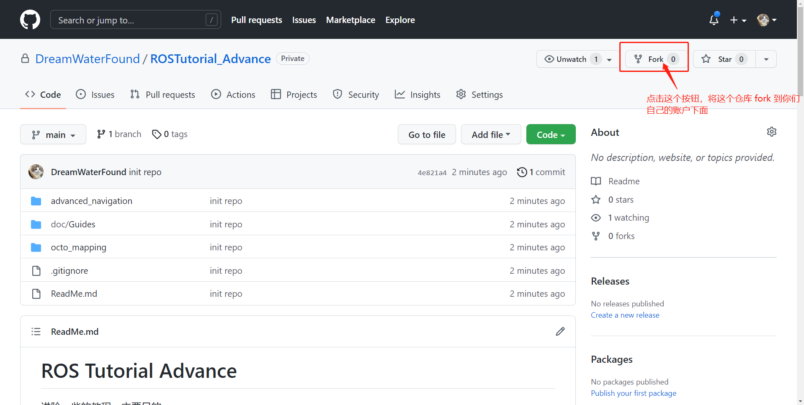
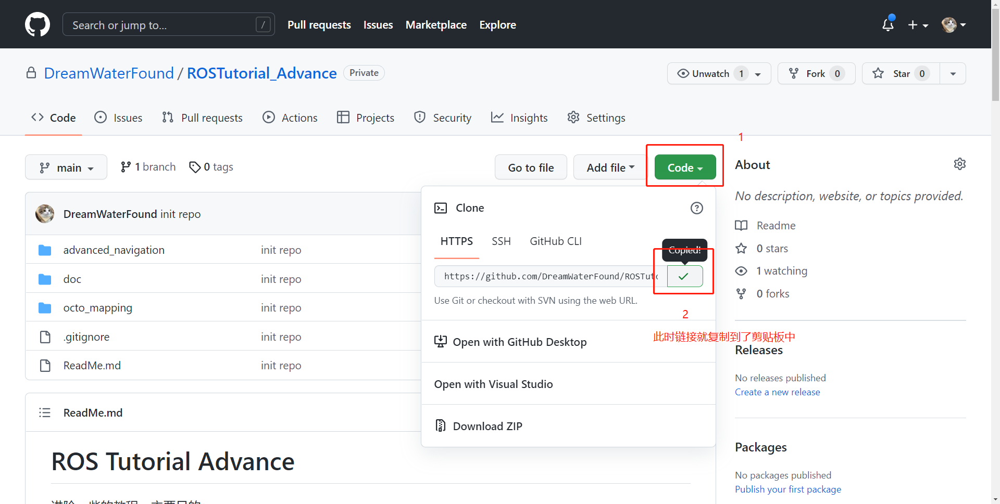
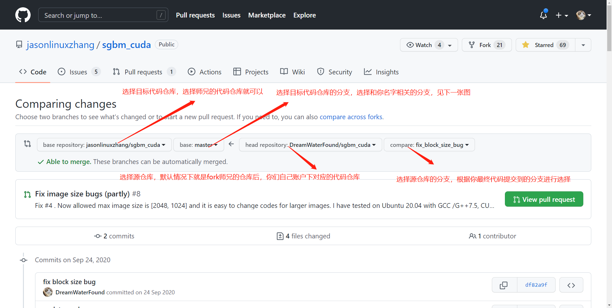
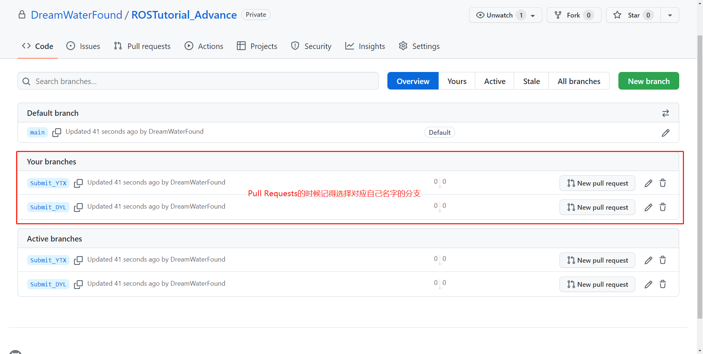
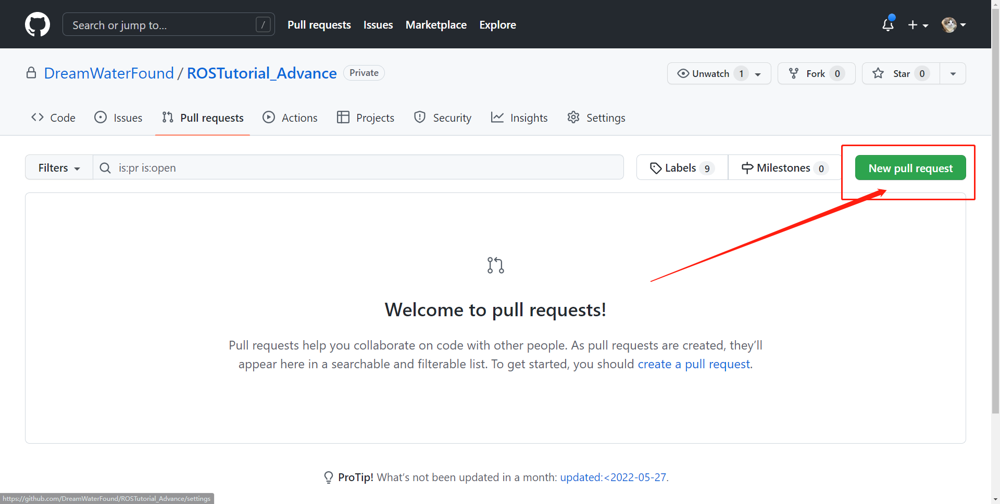
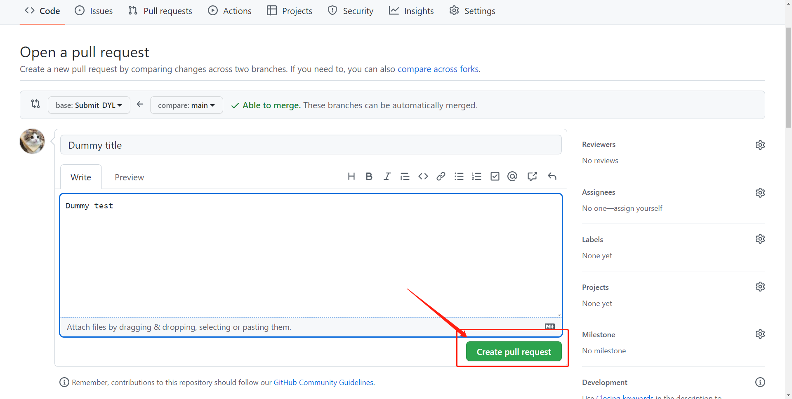
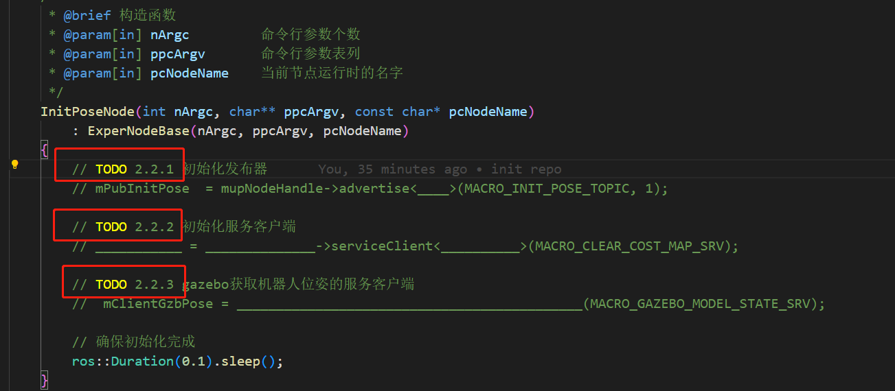

# ROS Tutorial Advance

进阶一些的教程，主要目的：

- 结合实践，尝试利用 ROS 下的各种概念、机制解决一些实际问题；
- 熟悉 ROS 下和 OpenCV、PCL 等库的操作；
- 通过代码了解一下你们的基本技能掌握情况；
- 利用这个仓库演习一下多人协作。

main 分支中是 需要补充的源码，其余两个分支则是留给你们提交补充后源码而创建的。

操作过程：

- 先同意我发出的仓库协作邀请（当看到这个文档的时候你们就已经完成了）；
- 点右上角的 Fork 按钮，将这个仓库 Fork 到你们自己的账户下；
  
- 创建一个专门的 ROS 工作空间，在**自己**账号下的该代码仓库中，git clone 到自己的电脑上. 例如：
  ```bash
  # 创建工作空间，这里放在 ~/ROSTutorial_ws 下，你可以放在任何你想放在的地方
  $ cd ~
  $ mkdir ROSTutorial_ws
  $ cd ROSTutorial_ws
  # 这里的链接在 Github 上可以直接生成，看下图
  $ git clone https://github.com/xxx/ROSTutorial_Advance.git
  # 其实这个仓库就是 ROS 工作空间下 src 文件夹的内容，咱们直接修改为 src
  $ mv ./ROSTutorial_Advance ./src   
  # 初始化 ROS 工作空间
  $ cd src
  $ catkin_init_workspace
  # 进行编译, 这个过程不应该有错误发生
  $ catkin_make 
  ```
  关于链接的获取：
  
  > 注意使用 git clone 的方式，不要下载 zip 的方式，这种方式只有代码本身，不会包含代码仓库信息
- 在**自己**的电脑上新建自己命名的分支（branch），**务必确保**在**自己**的分支下操作和处理代码；
- 看讲义[0](./doc/Guides/0、Turtlebot3-SLAM与导航虚拟仿真实验-课前准备.pdf)、[1](./doc/Guides/1、Turtlebot3-SLAM与导航虚拟仿真实验-讲义.pdf)，跟着做基础的实验。讲义建议下载后查看，在线查看好像有问题；
- 跟着讲义完成教程、补全代码、完成预期功能；
- 每当做出了关键性的进展要**及时提交**(commit)到本地代码仓库，并且**及时同步**到自己账号下Github的代码仓库；这是避免因为误删等意外原因，及时止损的关键办法，要养成及时commit的习惯；善用 branch；
- 每完成一个功能包的代码补全，确保本地代码同步到**自己**的Github仓库后，提交一个 Pull Requests到**师兄账户**下的仓库中、和你们自己名字相关的branch下。大致操作：
  - 在 Github 仓库页面，点击 `Pull Request` 选项卡：
  
  - 在新的界面中，选择提交合并申请的源仓库及分支，并指定目标仓库和分支。由于我自己没法完整演示，这里贴一个之前我将自己代码 pull request 到其他人仓库的例子：
  
  - 一定要选择正确的，和你们名字对应的分支，如：
  
  `Pull request`可能提示没有冲突（即`Able to merge`），也可能提示有冲突，这个都不要紧。多人代码协作时有冲突是十分正常的，这些冲突未来将由师兄来负责进行Code Review。
  - 点击 `Create pull request` 按钮, 下面的图示应该不正确，仅供参考：
  
  - 此时会让你输入此次 Pull Request 的解释，可以象征性地写一下，和提 issue 差不多。大致是下图的样子，但是应该和你们操作时的界面有出入：
  
  最后点击 `Create pull request` 按钮，整个过程就完成了，师兄这边就会收到相关通知，对你们提交的代码进行处理。


## 一些注意事项

- 讲义中所有关于 git 的操作**不要执行**，会搞乱你们自己的代码仓库
- 这样子的注释表示，此处需要补充的代码对应哪个章节的实验：
  
- 讲义中 3.5 节提到的实验不需要完成
- 讲义编写之初是面向已经系统性学习过ROS的本科生，为了实验课成绩有区分度而设计，越靠后的实验难度越大，所以在现阶段你们在做实验的过程中，有困难或者吃力的感觉是正常的，讲义和代码也有一些没说清楚或者存在错误的地方。有什么不懂或者疑惑的欢迎随时问我

## 变量命名规则

继承了匈牙利命名法的大部分特点. 这种命名方法看上去十分冗长, 但是不仅可以做到"见名知义",还可"见名知类型".
同学们自己写程序的时候还是以实现功能为第一要务, 不必遵循程序中的命名规则.
对于非数学对象, 变量名主要由: 作用域 + 类型 + 描述 组成. 如 `ExperNodeBase.hpp` 中的 `ExperNodeBase::mupNodeHandle`:
 - m:   member, 作用域, 表示这个变量是类的成员变量
 - up:  unique_ptr, 类型, 表示这个变量是 std::unique_ptr 型变量
 - NodeHandle: 描述, 遵循驼峰命名法, 表示这个变量和节点句柄相关

作用域一般有这几类:
 - m: member, 类的成员变量
 - l: local,  程序中定义的局部变量, 但是一般这个前缀不加
 - g: global, 全局变量
 
常用的类型有这几类:
基本类型:
 - n: number, int, unsigned int, long, uint64_t, size_t 等等表示整数的变量
 - c: 特指 char, unsigned char
 - f: float型浮点数
 - d: double 型浮点数
 - e: enum, 枚举变量
 - p: 指针, 通常与上述搭配, 如 pdMax 表示指向最大值的指针变量, 指向的变量是 double 类型
标准库类型:
 - str: string, 字符串, 通常指代 std::string
 - v:   vector, 通常指代 std::vector
 - map: map,    键值对映射表, 通常指代 std::map 一族
 - list:list,   列表, 通常指代 std::list
 - a:   array,  通常指代 boost::array 和 std::array,; 传统 C 风格数组使用 p 表示
 - sp:  shared_ptr, 共享指针, 通常指代 boost::shared_ptr 和 std::shared_ptr
 - up:  unique_ptr, 不知道咋说, 通常指代 boost::unique_ptr 和 std::unique_ptr

方便起见,对于指针和带有模板参数的基本类型和标准库类型可以"套娃":
```C++

std::vector<size_t> vnVar1;
std::unique_ptr<std::vector<float> > upvfVar2;
std::vector<std::vector<int*> >      vvpnVar3;
std::vector<std::vector<std::vector<float> > >
                                     vvvfVar3;
```


